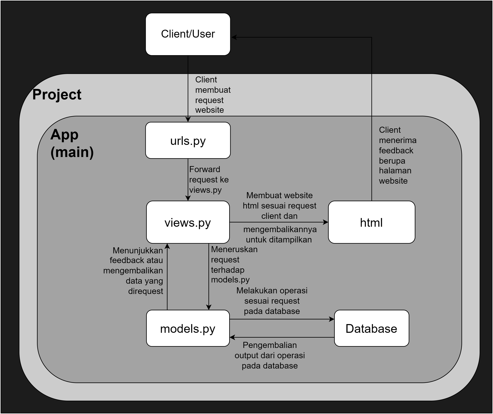
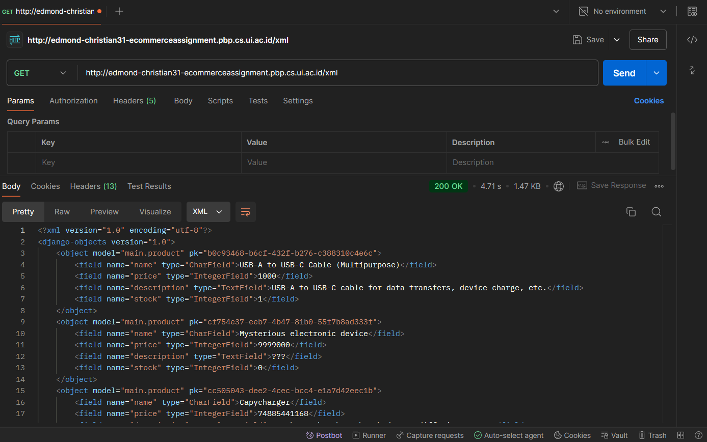
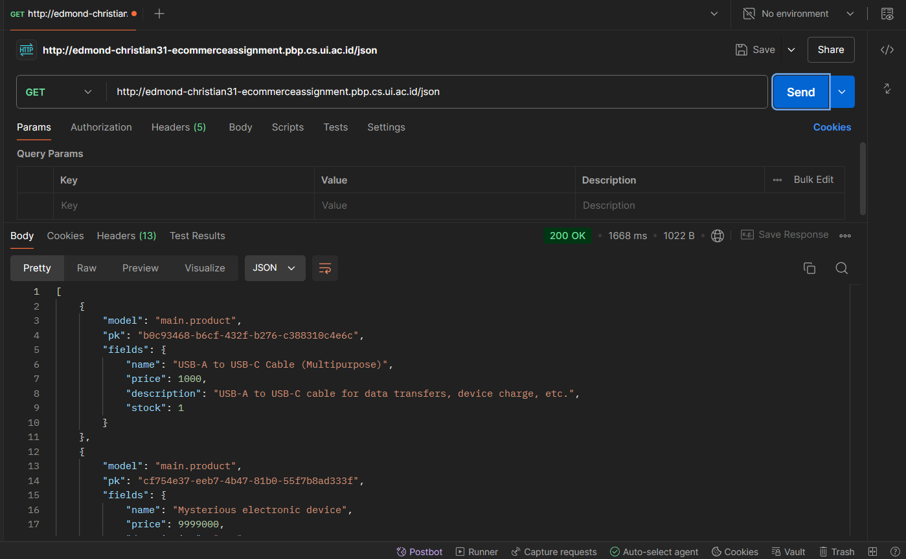
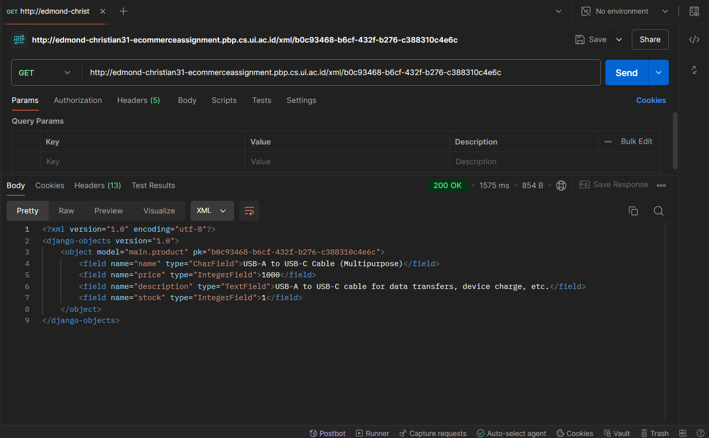
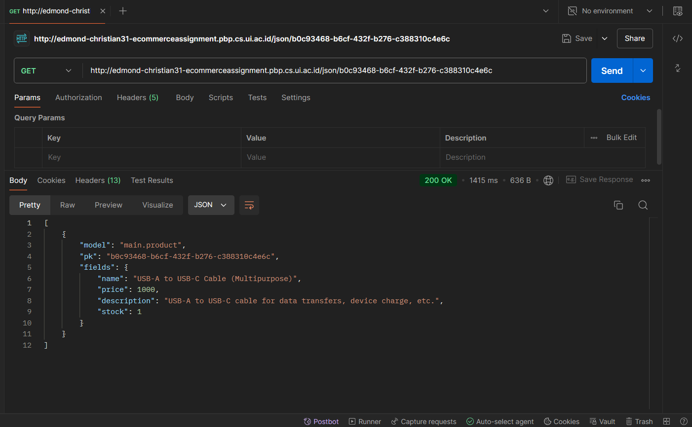
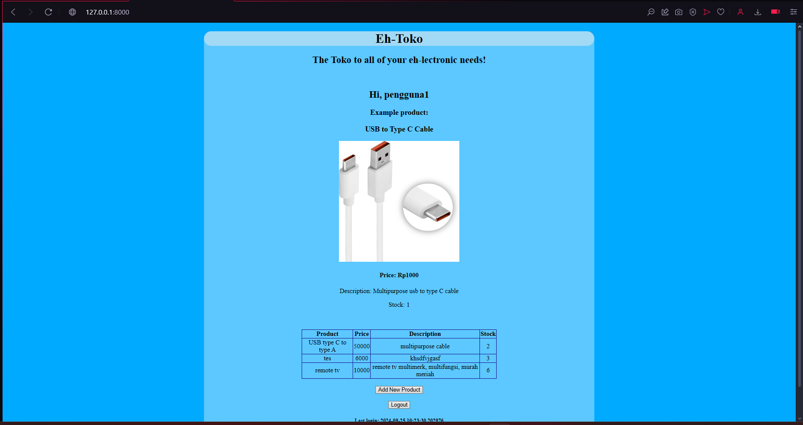
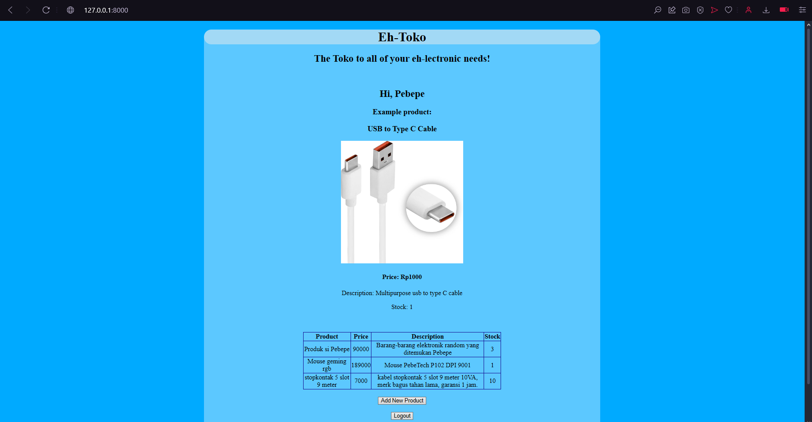

**Edmond Christian / 2306208363 / PBP D**

## Tugas 2

**Jelaskan bagaimana cara kamu mengimplementasikan checklist di atas secara step-by-step**

1. Membuat folder dengan nama project saya di komputer dan menyambungkannya dengan git.
2. Membuat repository kosong di github.
3. Melakukan commit dan push folder komputer ke dalam github untuk menyambungkan kedua git.
4. Membuat dan mengaktifkan virtual environment dengan `python -m venv env` kemudian `env\Scripts\activate`.
5. Menginstall library Django dan library lain yang diperlukan dengan membuat `requirements.txt` dan menjalankan `pip install -r requirements.txt`.
6. Membuat project Django dengan `django-admin startproject the_eh_toko .` dan mengkonfigurasikan localhost ke dalam allowed host di `settings.py`.
7. Mengecek apakah project berhasil terbuat dengan `python manage.py runserver`.
8. Membuat file `.gitignore` untuk membatasi file-file yang akan dipush ke github.
9. Melakukan initial commit dan push project ke github.
10. Membuat aplikasi `main` dalam project dengan `python manage.py startapp main` dan menambahkannya ke dalam `INSTALLED_APPS` di `settings.py`.
11. Membuat template `main.html` dan mengisinya dengan teks mengenai e-commerce yang dibikin dan produknya.
12. Membuat model `Product` dan melakukan migrasi  dengan `python manage.py makemigrations` dan `python manage.py migrate`.
13. Menambahkan fungsi pada `views.py` untuk mengembalikan `context` yang akan mengisi nilai variabel pada `main.html`.
14. Mengkonfigurasi routing project sehingga `main.html` muncul.
15. Melakukan push ke github.
16. Membuat project baru pada website PWS (Pacil Web Service).
17. Menambahkan `edmond-christian31-ecommerceassignment.pbp.cs.ui.ac.id` ke dalam allowed host project.
18. Menghubungkan project dengan PWS sesuai dengan panduan websitenya. 
19. Melakukan push terhadap branch pws dengan `git push pws master`.
20. Menunggu proses building project oleh PWS dan setelah selesai project dapat diakses melalui http://edmond-christian31-ecommerceassignment.pbp.cs.ui.ac.id/
(Setiap langkah tersebut tidak saya lakukan sekaligus, melainkan dalam beberapa sesi. Untuk setiap sesi saya mulai dengan `env\Scripts\activate` dan akhiri dengan `deactivate`).
21. Setelah project dapat terlihat dan benar, saya menambahkan gambar salah satu produk ke dalam `main.html`.
22. Penambahan gambar dilakukan dengan membuat folder baru `/static` pada folder aplikasi `main`, kemudian memasukan gambar ke dalam folder tersebut.
23. Pada `main.html` saya menambahkan `` di awal dokumen agar gambar di folder `/static` dapat ditemukan
24. Lalu saya juga mengganti beberapa teks dan formatting pada `main.html`
25. Terakhir saya melakukan push terhadap github dan WPS. (Pada website PWS, project mungkin belum menampilkan tampilan terbaru sebab build yang gagal karena PWS yang sedang bermasalah)


**Buatlah bagan yang berisi request client ke web aplikasi berbasis Django beserta responnya dan jelaskan pada bagan tersebut kaitan antara `urls.py`, `views.py`, `models.py`, dan berkas `html`.**




**Jelaskan fungsi git dalam pengembangan perangkat lunak!**

Git merupakan sebuah software version control, yang berarti git berfungsi untuk memanajemen perubahan suatu kode software. Pada pengembangan software tentunya akan terjadi banyak perubahan kode software, dengan git seseorang dapat menyimpan suatu versi dari softwarenya. Jika pengembang software tersebut ingin melakukan perubahan kode tanpa mengganti kode yang sekarang ia dapat membuat berbagai branch baru untuk melakukan testing dll., dan ia juga dapat kembali ke branch utama jika ingin melakukan hal yang berbeda. Dengan branching ini, lebih dari satu orang juga dapat bekerja pada suatu project atau aplikasi yang sama tanpa mengganggu satu sama lain yang di mana jika ingin dilakukan perubahannya perlu dimerge. Fungsi yang terakhir adalah, git dapat berperan sebagai backup jika kode utama memiliki kesalahan ataupun ingin kembali ke kode yang awal. Jadi fungsi git dalam pengembangan software secara singkat adalah meningkatkan efisiensi pengembangan software, memungkinkan kolaborasi dalam pengembangan software, dan sebagai backup versi software.


**Menurut Anda, dari semua framework yang ada, mengapa framework Django dijadikan permulaan pembelajaran pengembangan perangkat lunak?**

Menurut saya, karena Django merupakan framework yang populer (sehingga terdapat banyak resource mengenainya) dan cukup mudah dipahami karena menggunakan Python sebagai bahasa utamanya. Python merupakan bahasa yang telah dipelajari pada DDP1 dan merupakan bahasa pemrograman yang relatif lebih mudah dari bahasa pemrograman lain sehingga akan memudahkan kita dalam mempelajari Django. Selain itu, ada juga alasan lain mengapa Django dipilih yang awalnya saya tidak diketahui, seperti tertulis pada slide materi contohnya Django bersifat open source, cepat, sangat scalable, dan seterusnya.


**Mengapa model pada Django disebut sebagai ORM?**
Django disebut sebagai ORM (Object Relational Mapping) karena Django menyimpan data sebagai objek di Python, yang kemudian objek-objek tersebut yang berupa data dapat dipetakan terhadap tabel-tabelnya pada sebuah relational database umumnya seperti SQL. Selanjutnya, jika ingin mengolah atau melakukan hal terkait database dapat dilakukan menggunakan prinsip OOP (Object Oriented Programming) pada datanya.


## Tugas 3

**Jelaskan mengapa kita memerlukan *data delivery* dalam pengimplementasian sebuah platform?**
*Data delivery* dibutuhkan dalam sebuah platform agar platform tersebut dapat bersifat responsif terhadap pengguna, dengan kata lain *data delivery* memungkinkan sebuah platform seperti suatu website untuk menampilkan tampilan yang sesuai dan terus berubah menurut input user dan data yang berada pada basis data/*database* server websitenya. Tanpa data delivery, tampilan website mungkin terlihat statik ataupun tidak dapat diakses sama sekali sehingga memberikan kesan yang buruk terhadap pengguna platform tersebut.

**Menurutmu, mana yang lebih baik antara XML dan JSON? Mengapa JSON lebih populer dibandingkan XML?**
Menurut saya keduanya memiliki fungsinya masing-masing dan tidak ada yang secara keseluruhan lebih baik, namun jika saya harus memilih menggunakan antara keduanya saya akan memilih JSON karena format data dalam JSON yang lebih mudah dipahami dan lebih ringkas dibandingkan dengan XML. Alasan JSON lebih populer dibandingkan XML menurut saya yang utama adalah karena proses *parsing* data lebih cepat dilakukan dalam format JSON, ini dikarenakan formatnya yang lebih sedikit dan ringkas, tidak seperti format XML yang memiliki *tag* dan struktur yang lebih kompleks.

**Jelaskan fungsi dari method `is_valid()` pada form Django dan mengapa kita membutuhkan method tersebut?**
Sesuai namanya, method `is_valid()` pada form Django berfungsi untuk melakukan validasi atas setiap isian dari *field-field* yang ada pada form tersebut. Jika datanya valid maka method tersebut akan mengembalikan nilai boolean `true`. Contoh isian form yang valid adalah isian yang tidak kosong pada field yang bersifat wajib diisi. Method ini diperlukan pada form Django agar input pengguna sesuai yang developer inginkan dan juga menghindari input yang dapat mengganggu kinerja program.

**Mengapa kita membutuhkan `csrf_token` saat membuat form di Django? Apa yang dapat terjadi jika kita tidak menambahkan `csrf_token` pada form Django? Bagaimana hal tersebut dapat dimanfaatkan oleh penyerang?**
`csrf_token` dibutuhkan dalam sebuah form di Django agar saat melakukan submit form ataupun melakukan request lain, kegiatan tersebut dapat dipastikan berasal dari pengguna yang sudah diautentikasi dan bukan oleh pihak ketiga yang *malicious*. `csrf_token` sebuah pengguna dibuat secara acak untuk setiap sesi pengguna sehingga sulit untuk ditebak. Jika kita tidak menggunakan `csrf_token`, maka form yang disubmit atau request lainnya tidak dapat diautentikasi sehingga bisa saja bukan pengguna yang sebenarnya yang melakukan request atau mengsubmit form tersebut, melainkan orang lain yang ingin menyerang dengan identitas sebagai pengguna sebenarnya. Penyerang ini kemudian dapat melakukan request seperti mengsubmit isi form yang salah, atau melakukan request data penting pengguna asli.

**Jelaskan bagaimana cara kamu mengimplementasikan checklist di atas secara step-by-step**

1. Sebelum memulai proses pembuatan form, saya menambahkan `github/workflows/deploy.yml` terlebih dahulu agar kedepannya saat saya melakukan push project terhadap github, dilakukan juga push terhadap pws. Lalu saya juga mengecilkan gambar yang sebelumnya saya tambahkan di tugas 2.
2. Lalu saya menambahkan sebuah template atau kerangka yang akan digunakan sebagai template halaman-halaman yang berada di website saya.
3. Penambahannya adalah dengan membuat direktori `templates` pada root folder dan mengisinya dengan file `base.html` yang berisi beberapa `{% block ... % }`. `{% block ... % }` merupakan bagian html yang dapat diganti oleh konten-konten tertentu di halaman html yang sudah jadi.
4. Selanjutnya pada direktori project `the_eh_toko` saya menambahkan direktori tersebut ke dalam variabel `TEMPLATES` pada `settings.py`. 
5. Setelah itu, saya mengubah `base.html` yang berada pada direktori `main/templates/` sehingga menggunakan kerangka dari `base.html` yang sebelumnya sudah dibuat, dengan menambahkan `` dan mengapit isinya dengan `` dan ``.
6. Sebelum membuat form, saya menambahkan terlebih dahulu atribut `id` pada class object `Product` pada `models.py` yang akan disimpan di database. Atribut `id` yang dibuat menggunakan uuid64 agar bersifat acak dan tidak dapat ditebak (aman), fungsi atribut ini agar setiap object atau data memiliki *unique identifier*
7. Setelah menambahkan atribut pada `models.py`, saya menjalankan `makemigrations` dan `migrate` untuk melakukan pengubahan pada basis data.
8. Pada saat memulai pembuatan form, saya membuat terlebih dahulu `forms.py` di direktori `main` yang akan membuat struktur formulir yang nantinya akan ditampilkan. Isinya adalah sebuah class object baru, `NewProductForm` dan inner class `Meta` yang berisi mengenai object yang akan diterima dan isian mengenai atribut object. (Import class `Product` tentunya dilakukan).
9. Pada file `views.py` di direktori `main`, melakukan import `redirect`, `NewProductForm`, dan `Product`. Lalu membuat fungsi `add_product` dengan parameter _request_ yang berisi prosedur pembuatan form dan penyimpanan isi dari form.
10. Setelah itu, menambahkan beberapa line kode di fungsi `show_main` agar variabel `products` yang merupakan objek-objek atau data pada basis data dapat diteruskan menuju `main.html`.
11. Selanjutnya, mengimport fungsi `add_product` dan menambahkan _path_ terhadap halaman form pada `main/urls.py`.
12. Membuat file baru `main/templates/add_product.html` yang akan menjadi template untuk halaman formulir penambahan produk, file ini juga menggunakan kerangka `base.html` yang sudah dibikin.
13. Menambahkan kode di `main/templates/main.html` untuk menampilkan tabel yang _header_-nya merupakan atribut dari objek `Product` dan baris-baris selanjutnya merupakan objek `Product` yang telah ditambahkan melalui halaman formulir, selain itu juga menambahkan tombol untuk ke halaman formulir jika ingin menambahkan produk baru. Untuk mengamankan dan mencegah serangan ditambahkan juga `csrf_token`. Dengan ini maka proses pembuatan input form selesai.
14. Berikutnya, membuat 4 fungsi pada `views.py` untuk melihat objek-objek yang sudah dibuat dalam format XML, JSON, XML _by ID_, dan JSON _by ID_.
15. Diawali dengan melakukan import `HttpResponse` dan `Serializer` pada `views.py`.
16. Membuat fungsi `show_xml` dengan parameter _request_ yang mengembalikan data semua object `Product` yang diubah sehingga terbaca dalam format XML. Dengan kode sebagai berikut: 

```python
def show_xml(request):
    data = Product.objects.all()
    return HttpResponse(serializers.serialize("xml", data), content_type = "application/xml")
```

17. Melakukan import fungsi tersebut ke dalam `main/urls.py` dan di dalamnya menambahkan _path url_ agar terdapat halaman baru untuk melihat object dalam XML.
18. Untuk menambahkan fungsi yang menampilkan data dalam JSON, serupa dengan langkah-langkah pembuatan tampilan dalam XML pada langkah 14-15, dengan perbedaannya berada pada nama fungsinya menjadi `show_json` dan mengembalikan data berupa "json", yang kemudian dilanjutkan dengan routing.
19. Selanjutnya adalah proses menambahkan fungsi `show_xml_by_id` dan `show_json_by_id`. Prosesnya serupa dengan `show_xml` dan `show_json`, namun variabel `data` pada kedua fungsi tersebut diubah sehingga data yang diambil hanya yang memiliki id yang sesuai.

```python
    data = Product.objects.filter(pk = id)
```

20. Selanjutnya, menambahkan _path_ kedua fungsi tersebut sehingga dapat dilihat. _Path_-nya sama dengan _path_ jika ingin melihat keseluruhan object, namun ditambahkan dengan `/[id]` dengan `[id]` diubah oleh id object yang ingin dilihat secara satu-persatu.
21. Dengan itu 3 checklist pertama diselesaikan. Selanjutnya adalah checklist untuk menjawab pertanyaan-pertanyaan, di mana sumbernya adalah slide yang berada pada kelas PBP, pembelajaran di kelas, dan berbagai referensi lain di internet.

<b>Screenshot Postman</b>
<b>1. XML</b>


<b>2. JSON</b>


<b>3. XML/[id]</b>


<b>4. JSON/[id]</b>



## Tugas 4

**Apa perbedaan antara `HttpResponseRedirect()` dan `redirect()`**

`redirect()` merupakan sebuah fungsi dan `HttpResponseRedirect()` merupakan sebuah class yang tidak sepenuhnya terpisah, sebenarnya fungsi `redirect()` merupakan salah satu fungsi *shortcut* yang ada di Django. Di dalamnya, akan dikembalikan sebuah objek `HttpResponseRedirect()`. `HttpResponseRedirect()` kemudian akan melakukan respon *redirect* terhadap URL yang diberikan pada argumennya. Perbedaannya terdapat pada argumen yang diambil keduanya, fungsi `redirect()` mengambil argumen yang dapat berupa string URL contohnya `/login` atau `https://www.contoh.com`, sebuah model (yang kemudian akan melakukan *redirect* ke model tersebut dalam http), dan nama sebuah *view* contohnya `main:show_main` dan `main:login`. Sementara, objek `HttpResponseRedirect()` hanya bisa melakukan *redirect* jika argumennya merupakan string URL, sehingga `redirect()` memiliki argumen yang lebih fleksibel, jika ingin melakukan yang sama menggunakan `HttpResponseRedirect()` maka dapat digunakan fungsi seperti `reverse()` yang mengembalikan string URL dari sebuah *view*.

**Jelaskan cara kerja penghubungan model `Product` dengan `User`!**

Pada tugas 4 ini dihubungkan setiap model `Product` yang dibuat dengan seorang `User`. Langkah pertama yang dilakukan adalah menambahkan atribut *ForeignKey* pada model `Product`, selain menjadi dasar hubungan keduanya, hubungannya dengan `User` akan bersifat *many-to-one* yang berarti setiap `Product` akan terhubungan dengan 1 `User`, tetapi 1 `User` bisa terhubung dengan banyak `Product`. Selanjutnya adalah mengisi *field* tersebut dengan sebuah `User`. Hal ini terjadi saat proses penambahan produk di fungsi `add_product()`, saat `User` mengisi *form* untuk membuat objek `Product` baru, `User` itu akan disimpan dalam field *ForeignKey* `Product` sehingga objek yang terbuat akan terhubung dengan `User` dan kemudian dapat dilakukan operasi yang berkaitan misalnya mencari semua objek `Product` yang dibuat oleh `User` tertentu. 

**Apa perbedaan antara *authentication* dan *authorization*, apakah yang dilakukan saat pengguna login? Jelaskan bagaimana Django mengimplementasikan kedua konsep tersebut.**

Menurut definisi, *authentication* berarti proses verifikasi identitas seorang pengguna, dan *authorization* berarti proses verifikasi hak akses seorang pengguna terhadap sesuatu. Saat pengguna *login*, proses yang dilakukan adalah *authentication* karena aplikasi akan mengecek identitas pengguna berdasarkan kredensial yang diberikan, dan setelah identitas pengguna diverifikasi dan mereka memasuki aplikasi, akan dilakukan lagi *authorization* untuk mengecek lagi hak akses atau *permission* yang dimiliki pengguna pada aplikasi. Jadi di saat login akan dilakukan *authentication* yang diikuti oleh *authorization*. Django mengimplementasikan keduanya, *authentication* dilakukan melalui fungsi `login()` saat seorang pengguna ingin masuk ke dalam website untuk pertama kali, dan kemudian akan menyimpan keadaan *logged in* sebagai `User` yang kredensialnya sesuai untuk sesi tersebut. Selain itu, ada juga fungsi `authenticate()` yang akan mengecek kredensial yang dimasukkan dan kemudian mengembalikan `User` yang sesuai, dan jika tidak ada maka akan mengembalikan `None`. Lalu proses *authorization* pada Django juga diimplementasikan melalui beberapa fitur seperti *decorator* contohnya `@login_required` yang memungkinkan akses tertentu pada website hanya jika pengguna sedang dalam keadaan *logged in*. Selain itu, Django juga memiliki fitur *groups* sehingga setiap `User` dapat dimasukkan ke dalam grup-grup tertentu. Pada grup tersebut dapat diatur mengenai hak akses atau *permission* yang dimiliki `User` dalam website/aplikasi. Implementasi *authentication* dan *authorization* dalam Django selebihnya terdapat dalam library `django.contrib.auth`. 

**Bagaimana Django mengingat pengguna yang telah login? Jelaskan kegunaan lain dari *cookies* dan apakah semua cookies aman digunakan?**

Django mengingat pengguna yang telah *login* dengan membuat *cookie* `sessionid` di saat pengguna *login*, selama terdapat *cookie* tersebut pada halaman/aplikasi maka pengguna akan dianggap *logged in*, sebaliknya jika *cookie* tersebut dihapus atau tidak ada maka pengguna dianggap tidak *logged in*. Selain untuk proses *authentication*, kegunaan lain dari *cookie* adalah untuk menyimpan data terkait pengguna lainnya, seperti *preference* dan aktivitas pengguna dalam website. Salah satu contoh data yang bisa disimpan adalah waktu terakhir kali pengguna melakukan *login*. Setiap *cookie* yang ada aman digunakan, sebab yang *cookie* hanya menyimpan data yang berkaitan dengan websitenya. Namun, apabila keamanan suatu website tidak sempurna, maka data *cookie* seorang pengguna dapat dimiliki/diambil oleh pengguna lain dan dapat disalahgunakan. Contoh data berbahaya yang dapat diambil dari *cookie* adalah `sessionid` yang memungkinkan penyerang untuk berpura-pura menjadi `User` yang 'diambil' `sessionid`nya dan kemudian melakukan *request* terhadap website sebagai `User` tersebut.

**Jelaskan bagaimana cara kamu mengimplementasikan *checklist* di atas secara *step-by-step* (bukan hanya sekedar mengikuti tutorial)**

1. Melakukan import `UserCreationForm` dan `messages` pada `main/views.py`. `UserCreationForm` mengandung form default yang disediakan django untuk melakukan pendaftaran pengguna, sementara `messages` untuk menghasilkan pesan.
2. Membuat fungsi `register` pada `main/views` untuk menghasilkan halaman di mana pengguna dapat mendaftarkan akun, di dalam fungsinya juga ada return untul melakukan redirect ke halaman utama setelah melakukan pendaftaran/register.
3. Membuat template baru bernama `register.html` pada `main/templates` yang akan menjadi template halaman pendaftaran pengguna. Pada template akan terdapat form dalam bentuk tabel, dan message dalam bentuk list. Message yang dapat ditampilkan adalah pembuatan akun berhasil atau gagal.
4. Mengimport `register` ke dalam `main/urls.py` dan melakukan *routing* halaman register yang telah dibuat.
5. Melakukan import `AuthenticationForm`, `authenticate`, dan `login`. pada `main/views` untuk membuat form login user.
6. Membuat fungsi `login_user` untuk membuat fungsi yang menghasilkan halaman login pengguna. Di dalamnya digunakan `AuthenticationForm` yang mengecek input username dan password pengguna, jika benar dan valid maka akan diredirect ke halaman utama dan pengguna logged in dalam website.
7. Membuat template baru `login.html` pada `main/templates` yang akan menjadi halaman login pengguna. Kemudian dilakukan routing terhadapnya di dalam `main/urls.py`
8. Melakukan import `logout` kedalam `main/views.py` dan membuat fungsi `logout_user` untuk melakukan logout pengguna.
9. Menambahkan tombol untuk melakukan logout di halaman utama `main.html`, jika ditekan maka akan menjalankan fungsi untuk logout. Kemudian melakukan routing terhadap `logout_user` pada `main/urls.py`. Saya juga menambahkan sedikit spasi antara button logout dan menambahkan produk baru dengan menambahkan tag `<br>`.
10. Menambahkan kode `from django.contrib.auth.decorators import login_required` untuk mengimport `login_required`. Setelah itu menambahkan decorator `@login_required(login_url='/login')` pada fungsi `show_main`. Ini bertujuan agar seorang pengguna harus logged in terlebih dahulu jika ingin ke halaman utama toko, jika tidak logged in maka akan diredirect ke halaman login. 
11. Setelah itu, saya mengetes terlebih dahulu website saat itu. Saya juga menambahkan beberapa button untuk kembali ke halaman sebelumnya.
12. Selanjutnya untuk menggunakan *cookies*, mengimport `datetime`, `HttpResponseRedirect`, dan `reverse`. Setelah itu, menambahkan kode ke dalam fungsi `login_user`. Di dalam kode tersebut, akan dibuat *cookie* `last_login` yang menyimpan data berupa waktu pengguna login di saat itu.
13. Menambahkan key `last_login` ke dalam context pada fungsi `show_main` yang isinya berupa *cookie* dengan nama yang sama.
14. Memodifikasi kode fungsi `logout_user` agar saat pengguna keluar *cookie* `last_login` mereka dihapus.
15. Untuk menampilkan info seperti username pengguna yang logged in, menambahkan `main.html` dengan kode:

```html
...
<h3>Hi, {{username}}</h3>
...
```

16. Lalu, menambahkan key `username` pada `main/views.py` yang memiliki nilai username dari pengguna yang sedang logged in. Caranya dengan menambahkan fungsi `show_main` kode berikut:

```python
...
    'username': request.user.username,
...
``` 

17. Selanjutnya, menghubungkan model `Product` dengan `User`. Dimulai dengan melakukan import `User` ke dalam `main/models.py`. Lalu, menambahkan atribut `user` dengan potongan kode `user = models.ForeignKey(User, on_delete=models.CASCADE)`.
18. Menghubungkan model `Product` dan `User` dengan meng*assign* nilai dari atribut `user` dengan `User` yang sedang logged in. Caranya dengan memodifikasi kode pada fungsi `add_product` di `main/views.py` menjadi

```python
...
    if form.is_valid() and request.method == "POST":
        new_product = form.save(commit=False)
        new_product.user = request.user
        new_product.save()
        return redirect('main:show_main')
...
```

19. Memfilter tampilan data `Product` yang ditampilkan dengan menyaringnya sehingga hanya dimunculkan jika atribut `user`nya bernilai sama dengan `User` yang sedang logged in dengan memodifikasi fungsi `show_main` dengan:

```python
...
    products = Product.objects.filter(user=request.user)
...
```

20. Melakukan migrasi model dengan `python manage.py makemigrations` dan `python manage.py migrate`. Sementara itu semua objek `Product` yang ada akan dihubungkan ke user yang sama/default terlebih dahulu. Sekarang setiap pengguna hanya dapat melihat product yang ditambahkannya.
21. Melakukan import `os` pada `the_eh_toko/settings.py` dan memodifikasi kode agar mode debug Django hanya berjalan saat development (lokal) dengan:

```python
...
PRODUCTION = os.getenv("PRODUCTION", False)
DEBUG = not PRODUCTION
...
```

22. Selanjutnya saya menambahkan produk untuk 2 akun pengguna agar terdapat 3 produk masing-masing, untuk mengerjakan checklist 2.

Screenshot pengguna 1 dengan 3 produknya



Screenshot pengguna 2 dengan 3 produknya


## Tugas 4

**Jika terdapat beberapa CSS selector untuk suatu elemen HTML, jelaskan urutan prioritas pengambilan CSS selector tersebut!**

holder

**Mengapa responsive design menjadi konsep yang penting dalam pengembangan aplikasi web? Berikan contoh aplikasi yang sudah dan belum menerapkan responsive design!**

holder2

**Jelaskan perbedaan antara margin, border, dan padding, serta cara untuk mengimplementasikan ketiga hal tersebut!**

holder3

**Jelaskan konsep flex box dan grid layout beserta kegunaannya!**

holder4

**Jelaskan bagaimana cara kamu mengimplementasikan checklist di atas secara step-by-step (bukan hanya sekadar mengikuti tutorial)!**

1. Langkah pertama adalah untuk menambahkan fitur edit produk terlebih dahulu.
2. Menambahkan fungsi `edit_product` pada `main/views.py` yang akan mengembalikan *context* berupa formulir untuk halaman edit produk dan menyimpan perubahan yang ada pada formulir terhadap objek produk.
3. Membuat berkas HTML baru `edit_product.html` pada `main/templates` yang akan menjadi template halaman edit produk dan kemudian melakukan routing terhadapnya pada `main/urls.py`.
4. Menambahkan tombol untuk mengedit produk di `main/templates/main.html` di tabel yang menampilankan produk. Dengan ini maka tombol edit akan muncul di baris setiap produk.
5. Memulai menambahkan fitur menghapus produk dengan menambahkan fungsi `delete_product` pada `main/views.py`. Fungsi ini memiliki parameter *request* dan *id*, saat fungsi ini dilakukan maka objek produk dengan *id* yang sesuai akan dihapus dari *database*.
6. Melakukan routing untuk respons fungsi menghapus produk pada `main/urls.py`. 
7. Menambahkan tombol untuk menghapus produk di `main/templates/main.html` sehingga saat dipencet akan menghapus produk di tabel dan redirect kembali ke halaman utama sehingga ter*refresh* dan produk hilang.
8. Menambahkan imagefield dengan menambahkan folder untuk *media* pada `the_eh_toko/settings.py`, kemudian melakukan routing pada `the_eh_toko/urls.py`
9. 